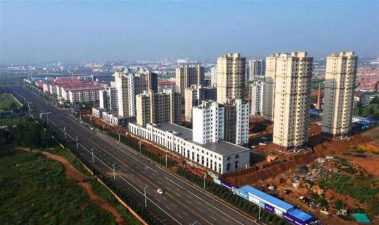
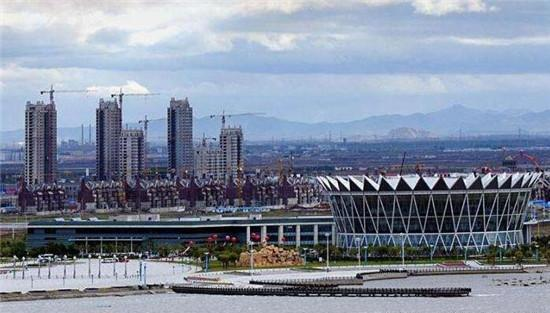

# 资本积累、技术进步与经济增长 --- 基建狂魔与鬼城

宏观经济学中最基本的总量生产函数($Y=AF(K, L)$)表明，总产出的主要决定因素只有三个：资本，劳动和技术。在过去的三、四十年里，中国快速增长的最显著的特点之一是资本积累的快速增长。在众多的资本积累的成就中，有两点特别值得注意。

第一，我们知道，大部分的资本存量是由建筑物、构筑物组成的，所以大量的房地产以及基础设施是资本快速积累的明显证据。在中国，房地产行业的资本存量正是随着大规模的城市化进程不断增长的。中国城市的规模已经变得非常惊人，但是建设过程中也出现了大量烂尾工程，造就了一批长年空置的“鬼城”。

乌兰察布市宁新区

乌兰察布市宁新区，典型的“地广人稀”，面积达到30平方公里，人口仅为31200人。如雨后春笋出现的房产大楼一片萧条，成为蒙古草原上的一座鬼城。白天街道车少人稀，夜晚更是寂静。

营口沿海产业基地

营口沿海产业基地，总规划面积252平方公里，分三期开发。现已建成一期40平方公里，二期正在建设中，但人口才2.27万人。当地不少房产入住率为零，巨量的房产供应没有消费者消化。沿海产业基地至少有20多个在售楼盘，其中大约有一半的项目已经停工或烂尾，夜里亮灯率超过一成的小区屈指可数。

第二，如果前面说的鬼城多少有些“负能量”的话，那么如果说中国近年来有了一个“基建狂魔”的称号，那就妥妥地正能量了。中央电视台在2018年3月在“第一时间”栏目中推出了一系列中国在基础设施建设领域取得巨大成就的专栏，其中有一个案例的标题是“厉害了我的国---中国速度：9小时建成一座火车站”，介绍了福建龙岩，在大约9个小时内建成的了一座火车站，着实令人叹为观止，消息传到国外，也是赢得一片赞誉，科技牛人马斯克专门发了Twitter点赞。视频连接地址如下：

http://tv.cctv.com/2018/03/06/VIDEDOLnRyGYJTQLhQOuNNdR180306.shtml

在那么短的时间内建立这样的资本需要难以置信的努力，这让人看了很震撼，中国人高速建设的能力也毋庸置疑。但它也应该提醒我们，如果不结合实际情况，只看资本积累的数量$K_{t+1} - K_{t}$ 的增长或资本的增长率$g_K$的提高，可能不一定有那么大的意义。

第一，在这段视频中，令人最为感动的亮点之一是，这项车站改造工程动用了1500余名工人连夜奋战，这强大的动员能力和组织协调能力，确实令人震撼，马斯克表示，这速度可能比美国要快100倍。但恰恰是这一点也需要我们冷静看待的。的确，火车站代表了新的资本，而这些资本注定会增加未来生产GDP的能力。但也需要注意到以每个工人人均GDP衡量的劳动生产率可能就相当低了。利用大规模的劳动力建设新资本并不意味着是非常可取，它可能更多地是意味着我们能够将大量低生产率的劳动力组织到项目中的能力。（这当然也是很牛的）

第二件要注意的事情是，资本的边际报酬是递减的。积累大量的新资本并不能确保对GDP的增加会很大。当一个经济体已经拥有足够更多的资本时，这一点尤其明显。我们用产出的资本弹性系数（$\alpha$）来说明一点，它表明如果**只**将资本增加一倍，产出的增加会不到一倍。更准确地说，总产出（GDP）对于资本的导数，即资本的边际报酬是

$$MPK = \frac{dY}{dK} = \alpha \frac{Y}{K} = \alpha \left(\frac{AL}{K}\right)^{1-\alpha}$$

因此，随着资本量的增加，资本的边际报酬就会*下降*。唯一能抵消这一点的是人口$L$的增加或生产力水平$A$的增加。但这些来自不同的过程，而不是来自资本的积累。

通过观察中国的这些“鬼城”，你可以看到现实生活中的资本边际报酬递减的例子。在过去的几十年里，中国很多地方政府已经建造了大量的“开发新区”、“产业新城”等，每座这样的城市能可能容纳数十万甚至数百万人，但其中许多城市仍然是空的。

这些城市（鬼城）都代表着较大的资本存量，但它们对GDP有什么贡献？什么都没有。这些鬼城的资本的边际报酬是零。仅仅建造越来越多的建筑本身并不能确保会有更多的经济活动发生。这些地方政府通过努力地招商引资的确已经吸引了一些企业到这些城市来投资，但请注意，像富士康这样的公司（生产iPhone的公司）本来就在其他地方生产。这些地方政府的行为只是在对现有的经济活动进行洗牌，不一定是增加新的经济活动。

第三，中国资本增长的这些例子是一个很好的例子，说明我们需要将资本形成总额的影响与资本对GDP的影响要分开的必要性。当一个建造一个新的工程项目，这是资本形成总额的一部分，也是*当年*GDP的一部分。但是，一旦该工程项目建成，它对GDP的贡献就取决于在工程*之内*发生的经济活动。如果建成的项目成了鬼城，这个贡献就是零，所有的资本就都是没有任何贡献。

%我信可以用房地产行业的情况做个类比（无论是在中国还是在美国还是在任何地方）。在要新开工建造一栋公寓楼时，可能要拆迁，然后重建，那么这个建设活动就是资本形成总额的一部分，并直接成为*当年*GDP的一部分。如果这栋楼在2019年花了1000万元建造，那么这1000万就是2019年GDP的一部分。但当公寓楼在2020年竣工后，它对GDP的贡献就只包括它从租户那里赚取的租金了，也许是每年20万元。因此不要把公寓楼的价值（1000万左右）和GDP的流量混淆起来。中国的城市也一样。不要把这些城市的建设价值（几百万和几千万）与它们的GDP流量（零）混淆起来。

最后，这种快速的资本积累还会提醒我们，经济学的核心理念是机会成本。由于建造了这些鬼城，这些资源本来可以用于什么？因为在9小时内建立了一个火车站而无法将资源用于其他的用途是什么？请记住索洛模型，资本形成总额要求我们花费GDP的一些部分$s_I$用于新的资本品。这部分GDP就不能用于其他方面了：医疗保健、教育、娱乐、食品、服装、电视、汽车、啤酒、面包圈等等。建造所有这些资本的成本必将是牺牲当前的消费。

当然，这对中国来说很可能是一个值得的权衡。今天建造大量的资本存量可以在未来产生巨大的GDP流，确保未来可以有较高的消费水平。这些资本积累能否做到这一点还有待观察。

不过，有一点不妨记住，如果在2049年，你仍然看到中国还在宣传某建筑项目使用1500名工人耗时9小时的视频，那可能就有些问题了。资本积累的全部意义在于提高工人的生产力。如果仍然需要那么多人来做这些项目，那么意义何在？

资本积累肯定是经济增长故事的一部分，但不要轻易下结论说它是经济增长中唯一重要的部分。